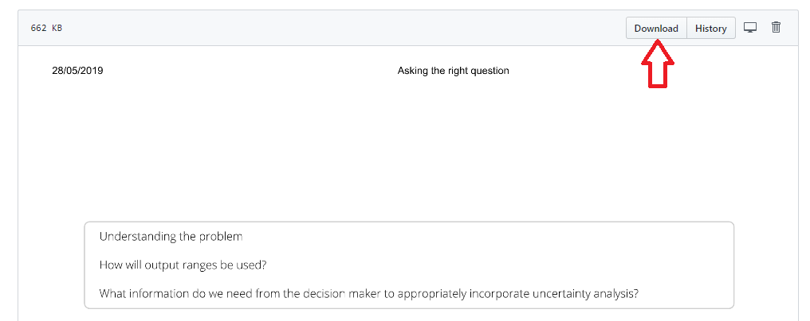

<style type="text/css">

.footer{
  position: relative; 
  margin-top: 1000px; 
  height = 100px; 
  width: 100%;
  text-align: left
}
.
</style>
You can download the whole website as a pdf by going to this <a href="https://github.com/AnalystsUncertaintyToolkit/UncertaintyWeb/tree/master/PDF_chapters/Uncertainty_Toolkit_for_Analysts_in_Government_-_full_content.pdf" style="color: DARKBLUE";> <b>link</b></a>.


Alternatively, you can download pdf versions of each chapter by going to this <a href="https://github.com/AnalystsUncertaintyToolkit/UncertaintyWeb/tree/master/PDF_chapters" style="color: DARKBLUE";> <b>link</b></a>, clicking on the chapter you wish to download and then clicking the download button.

```{r fig.align="center", echo=FALSE, out.width='100%'}



```


<div class="footer">
<b>Useful links:</b>
<br><br>
<a href="accessibility.html">Click here to see the accessibility statement</a>
<br><br>
<a href="index.html">Click here to return to home page</a>
</div>