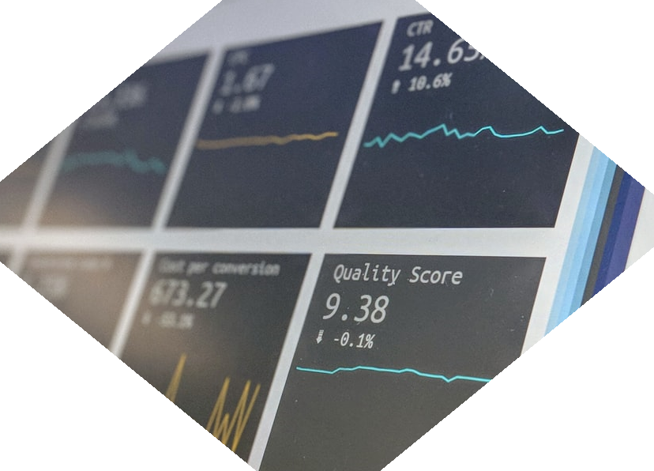

<style type="text/css">

:lang(en) {
}


#TOC{
margin-top: 100px;
}

.list-group-item.active, .list-group-item.active:hover, .list-group-item.active:focus {
background-color: DARKBLUE;
}  

body {
counter-reset : h1;
}

h1 {
  counter-reset:h2;
}

h2 {
counter-reset : h3;
}

h1:before{
  content : "2" ". ";
  counter-increment: h1;
}

h2:before {
content : "2" "." counter(h2,decimal) ". ";
counter-increment : h2;
}

h2.nocount:before {
content : "";
counter-increment : none;
}

.section h2{
padding-top: 200px;
float:right;
width: 75%;
}

.section h3{
float:right;
width: 75%;
}

hr { 
  display: block;
  margin-top: 0.5em;
  margin-bottom: 0.5em;
  margin-left: auto;
  margin-right: auto;
  border-style: inset;
  border-width: 1px;
  width: 75%;
  float: right;
} 

.rightA{
float:right;
width: 75%;
}

.leftB{
float: left;
width: 23%;
text-align: right;
}

.footer{
  position: relative; 
  margin-top: 1000px; 
  height = 100px; 
  width: 100%;
  text-align: left
}

.
</style>

# Jointly agreeing how uncertainty should be used

<br>

<div class = "rightA">
Decision-makers need information about uncertainty in the impacts of their decisions. This section looks at the steps to ensure that analysts and decision-makers agree on the question being asked, how analytical outputs will be used in the decision-making process, and how to appropriately incorporate uncertainty into the analysis.
</div>

## Understanding the problem

<div style="clear: both;"></div>

<hr>

<div style="clear: both;"></div>

<br>

<div class = "leftB">
Clarify what the real question is
</div>

<div class = "rightA">
It is important to ensure that the question is correctly framed to address the problem. For example, are we really interested in 'how much money is this new policy likely to save?', or should we be asking 'how certain can we that this policy would save more than &#163;x?'.  
</div>

<br>

<div class = "rightA">
As well as clearly defining the question, we should also ensure that any important detailed questions to support the analysis are appropriately thought through. For example, are we interested in uncertainty on a calendar year or financial year basis? 
</div>

<div class = "rightA">
You may also want to jointly identify sources of uncertainty that are so deep that little or nothing can be said quantitatively about their impact on the outcome. An example might be the impact of a natural disaster on a particular policy. Deep uncertainties can have major implications for decision making, and may call for a descriptive approach to the analysis and presentation of options. 
</div>

<div class = "leftB">
Identify the important details
</div>

<br>

<div class = "rightA">
Once the key questions have been agreed, analysts and decision-makers should discuss how the outputs will be used. Understanding the role of the analysis in the decision-making process will help to inform which uncertainty techniques are appropriate and proportionate. 
</div>

<div style="clear: both;"></div>


```{r fig.align="center", echo=FALSE, out.width='100%', alt=""}

knitr::include_graphics("images/Question.png")

```

## How will outputs be used?

<div style="clear: both;"></div>

<hr>

<div style="clear: both;"></div>

<br>

<div class = "leftB">
Discuss the role for the analysis
</div>

<div class = "rightA">
Will the decision be based purely on the results of the analysis, or is it just one of a wider set of considerations informing the decision? The more influential the analysis is, the more important it is to build in robust uncertainty analysis.
</div>

<br>

<div class = "rightA">
If the output is to be fed into ‘downstream’ models, then it is important to understand the requirements of those models. For example, if <i>scenarios</i> are used to illustrate uncertainty in your model, then these may not be suitable inputs for a Monte Carlo simulation in a dependent model.
</div>

<div class = "leftB">
Are there dependent models drawing on the analysis?
</div>

<div class = "rightA">
Now that we know what the question is and the context in which the analysis will be used, we should agree how to build appropriate uncertainty into the analysis. It is a good idea to ask the decision maker what it is conceptually that they <i>would like</i> to be able to say. This is important as it frames how the uncertainty analysis will be conducted. 
</div>


```{r fig.align="center", echo=FALSE, out.width='100%', alt = ""}



```


<div style="clear: both;"></div>

## Work with the decision maker to inform their decision at the right time

<div style="clear: both;"></div>

<hr>

<div style="clear: both;"></div>

<div class = "leftB">
Explain how the uncertainty can be used to better inform decisions
</div>

<div class = "rightA">
We can help the decision-maker to understand how information about the uncertainty present in the analysis supports a better informed and more robust decision. It's important to make it clear that not all sources of uncertainty will be quantifiable and/or supported by robust evidence, and we should jointly prioritise the key sources of uncertainty that need to be included in the model.
</div>

<div class = "rightA">
We can assess the impact of uncertainty using many different techniques. Not all will be appropriate for a given piece of analysis. A poor choice of technique may even give misleading results. For example, if there are many sources of uncertainty, the use of 95% confidence intervals to describe just one limited part of this uncertainty may be misleading, and modelling a range of described scenarios may be more appropriate. Appropriate presentation, such as rounding, is equally important to avoid spurious accuracy and impling better precision than is actually the case. Communication is covered further in the <a href="https://analystsuncertaintytoolkit.github.io/UncertaintyWeb/chapter_4.html" style="color: DARKBLUE;"> <b>presenting and communicating uncertainty section</b></a>.
</div>

<div class = "leftB">
Avoid misleading results or spurious accuracy by choosing the appropriate presentation
</div>

<div class = "rightA">
Discuss with the decision-maker what level of uncertainty is acceptable. Do they want to know how wrong the forecast would need to be in order to change or rethink the policy? Or are they simply interested in an output “range”? If so, what does that “range” actually mean?
</div>

<div class = "leftB">
Discuss how the uncertainty will inform the decision-maker’s judgement
</div>

<div class = "rightA">
Examples can be very helpful when discussing the analysis with the decision maker. An answer to the question of the net benefits of a policy may be &#163;3m, with uncertainty analysis giving a broad range of &#163;0.5-5.5m. You could discuss with the decision maker how they want to be able to frame the analysis, for example: <br> <i>"A range of &#163;0.5-5.5m";
<br> "The estimated benefits are &#163;3m, with analysis showing a 90% likelihood that benefits will be between &#163;1-5m";
<br> "Analysis shows that there is an 80% likelihood that the net benefits will be greater than &#163;2m";
<br> "The policy needs to have X amount of takeup in order to break even"</i>
</div>

<div class = "rightA">
Operational decision makers may not want to see a range of results, but instead want to plan to a certain level of confidence, such as 65% or 95% rather than 50%. For example, when planning the number of schools, prison places or GPs we’ll need over the next 5 years, it may be more appropriate to plan to a higher level of confidence than 50%.
</div>

<div class = "rightA">
Financial decision makers may be interested in understanding the likelihood of receiving a certain level of income, or that risks and opportunities will materialise. For example, HMRC might want to know the likelihood of receiving a certain level from tax receipts. Here, the analysis would need to go hand in hand with financial risk management to mitigate the risks materialising or crystallise the opportunities.
</div>

<div class="footer">
<b>Useful links:</b>
<br><br>
<a href="accessibility.html">Click here to see the accessibility statement</a>
<br><br>
<a href="index.html">Click here to return to home page</a>
</div>

