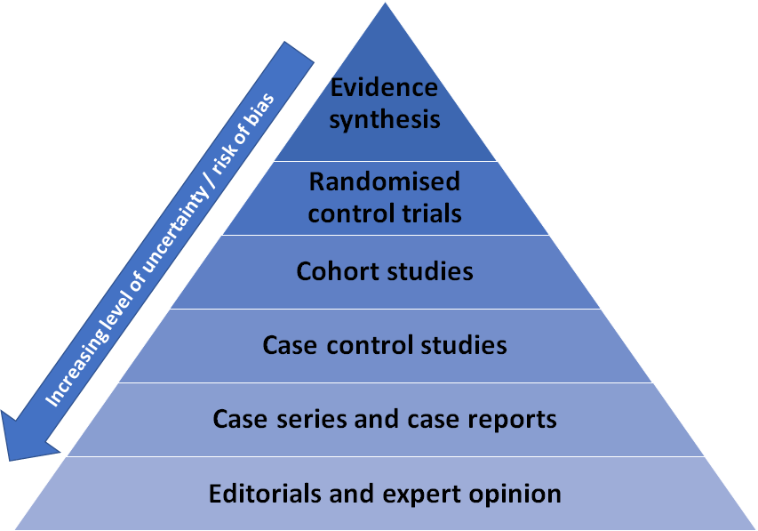

<style type="text/css">

#TOC {
margin-top: 50px;
}

.list-group-item.active, .list-group-item.active:hover, .list-group-item.active:focus {
background-color: DARKBLUE;
} 

body {
margin-top: 150px;
counter-reset : h1;
}

.title{
display : none;
}

h1 {
  counter-reset:h2;
}

h2 {
counter-reset : h3;
}

h1:before{
  content : "4" ". ";
  counter-increment: h1;
}

h2:before {
content : "4" "." counter(h2,decimal) ". ";
counter-increment : h2;
}

h2.nocount:before {
content : "";
counter-increment : none;
}

.section h2{
padding-top: 200px;
float:right;
width: 75%;
}

hr { 
  display: block;
  margin-top: 0.5em;
  margin-bottom: 0.5em;
  margin-left: auto;
  margin-right: auto;
  border-style: inset;
  border-width: 1px;
  width: 75%;
  float: right;
} 

.section h3{
float:right;
width: 75%;
}

.leftA{
float: left;
width: 100%;
font-weight: bold;
}

.rightA{
float:right;
width: 75%;
}

.leftB{
float: left;
width: 23%;
text-align: right;
}

.footer{
  position: relative; 
  margin-top: 100px; 
  height = 100px; 
  width: 100%;
  text-align: left
}


.
</style>

<div class="pageContentWrapper">

# Mitigating uncertainty 

<!-- introduction here?*-->

## Mitigating uncertainty in quantitative data analysis

<div style="clear: both;"></div>

<hr>

<div style="clear: both;"></div>

<div class = "rightA">
If the data is missing across all observations, for example due to test design, failure in the observations or failure in recording observations, the data can be classified as missing completely at random (MCAR). This is because the reasons for its absence are external and not related to the value of the observation. It is typically safe to remove MCAR data because the results will be unbiased. The statistical test(s) you are performing may not be as powerful, but the results will be reliable.
<br>

Listwise deletion involves deleting all data for an observation that has one or more missing values. The analysis is run only on observations that have a complete set of data. If the number of observations with missing data is small, it may be the most efficient method to handle missing data. However, if listwise deletion would result in throwing away a lot of your data, pairwise deletion may be more appropriate. Here, cases with missing data are used when analysing variables where they don’t have missing values. For example, if you are missing data on a participant's gender then this participant would be excluded from any analysis using the gender variable but would be included in any analyses for which the participant has complete data. However, the resulting statistics may vary because they are based on different data sets.
<br>

If the data is missing systematically, imputation can be more appropriate. The imputation method develops reasonable guesses for missing data. A common technique used when the number of missing cases is small is to impute the mean or median. For datasets with a large amount of missing data, multiple imputation is often used. Here, instead of substituting a single value for each missing data point, multiple imputed data sets are created where the missing values are exchanged for values that encompass the natural variability and uncertainty of the observed values. Each set is then analysed using the standard analytical procedures, and the multiple analysis results are combined to produce an overall result.

The website <a href="https://www.mastersindatascience.org/learning/how-to-deal-with-missing-data/#:~:text=%2520How%2520to%2520Deal%2520with%2520Missing%2520Data%2520,a%2520large%2520amount%2520of%2520missing%2520data.%2520More%2520" style="color: DARKBLUE;"><b>How to Deal with Missing Data</b></a> provides a useful overview of methods to deal with missing data.
</div>

<div class = "leftB"> 
To decide what method is appropriate to use to deal with missing data, you need to understand why the data is missing.
</div>

<div class = "rightA">
The probability of making a type I error (or a false positive) is represented by your significance level (or alpha level): a 0.05 significance level indicates that you are willing to accept a 5% probability that your results occurred by chance.
<br>

If you need to be very confident that your results are not going to be a false positive, you can decrease your significance level, for example to 0.01. Because this change increases the amount of evidence required to conclude a difference is significant, it makes your test less sensitive to detecting differences, but decreases the chance of committing a Type I error (or a false positive) occurring from 5% to 1%.
<br>

However, using a lower value for alpha means that you will be less likely to detect a true difference if one really exists, which increases the risk of a type II error occurring.
</div>

<div class = "leftB"> 
If you need to be very confident that your results are not going to be a false positive (concluding there is a significant difference when it has actually occurred by chance), you can decrease your significance level
</div>

<div class = "rightA"> 
A type II error is when you conclude there is no significant difference when one does in fact exist. You can reduce the risk of a type II error by ensuring your sample size is large enough to detect a difference when one truly exists.
</div>

<div class = "leftB">
You can decrease your risk of committing a type II error by ensuring your test has enough statistical power
</div>

<div style="clear: both;"></div>

<div class = "rightA">
Synthesis methods include systematic review and meta-analyses. These methods include reviewing study characteristics and quality and, where relevant, combine data in a statistical synthesis of study findings. Evidence synthesis (i.e. systematic reviews and meta-analyses) sit at the top of the ‘evidence pyramid’. This means they are considered the evidence source with the least uncertainty and highest rigour as their design minimises bias and maximises your ability to ascertain causality. However, the types of evidence at the top of the pyramid may not be available or feasible for your research topic of interest, in which case you will need to move down the evidence pyramid (note that this is not a comprehensive list of potential evidence sources):
</div>

<div class = "leftB">
Combining findings from a range of studies, known as synthesis, allows you to draw conclusions from a body of evidence
</div>

```{r fig.align="center", echo=FALSE, alt = ""}



```

<div style="clear: both;"></div>


## Mitigating uncertainty in experimental and quasi-experimental evaluation methods

<div style="clear: both;"></div>

<hr>

<div style="clear: both;"></div>

<div class = "rightA"> 
This depends on the collection of comparable data from both the intervention and control groups to ensure you can measure the intervention effect. In addition, the intervention effect must be large enough to be distinguished from noise in the data. Details of how to design a counterfactual for quasi-experimental and experimental studies can be found in the <a href="https://www.gov.uk/government/publications/the-magenta-book" style="color: DARKBLUE;"><b>Magenta Book</b></a>.
</div>

<div class = "leftB">
The counterfactual and intervention group must be comparable
</div>

<div class = "rightA">
Details of which methods are appropriate for different situations are explained in section 3.5 of the <a href="https://www.gov.uk/government/publications/the-magenta-book" style="color: DARKBLUE;"><b>Magenta Book</b></a>.
<br>

Where no comparison group is available, as in the case of analysing the impact of a global event like the COVID-19 pandemic or 2008 economic crisis, you can use an interrupted time-series approach. However, this is only appropriate where changes are sudden. This approach option is preferred to binary before-after comparisons which can be misleading as they present data out of the context of underlying trends.
</div>

<div class = "leftB">
Where it is not possible to run an experimental study to measure impact, you should select a quasi-experimental method based on the availability of a comparison group
</div>

<div class = "rightA">
Developing a comprehensive theory of change to explain how inputs of the intervention lead to outputs, outcomes and impact and testing it against existing evidence will help identify what data is needed for an impact evaluation. Having a robust, high quality theory of change will also ensure that you do not miss any key indicators and alert you to any potential unintended consequences that may need to be measured.
<br>

There is a useful <a href="https://www.gov.uk/guidance/evaluation-in-health-and-wellbeing-creating-a-logic-model" style="color: DARKBLUE;"><b>logic models guide on gov.uk</b></a>. This goes through the process of creating a logic model and provides examples and templates. There is also some good guidance on developing and using logic models from the <a href="https://www.nuffieldtrust.org.uk/files/2019-02/stephanie-kumpunen-and-muna-sheikh.pdf" style="color: DARKBLUE;"><b>Nuffield Trust</b></a> and a <a href="https://www.cdc.gov/eval/steps/step2/index.htm" style="color: DARKBLUE;"><b>step by step guide from the US CDC</b></a>.
</div>

<div class = "leftB">
Ensuring you have a solid grounding in the theory underpinning your intervention is essential for an effective evaluation design.
</div>

<div class = "rightA">
Comparing estimated effect sizes to effect sizes from other studies in different contexts can be useful for setting realistic expectations of effects and thereby guide the research design (e.g. required sample size, whether effects are homogeneous or heterogeneous). Benchmarking can also help to understand similarities and differences between the effects of interventions in different contexts.
</div>

<div class = "leftB">
A baseline, or starting point, can also serve as a benchmark against which future progress and effects of an intervention can be assessed.
</div>

<div style="clear: both;"></div>

<div class = "rightA">
Theory-based impact evaluations make conclusions about the effect of an intervention through testing the causal pathways through which the change is brought about. This method assesses whether the evidence is sufficient to support these causal pathways and that alternative explanations can be ruled out. The Magenta Book provides further guidance on theory-based evaluation.
</div>

<div class = "leftB">
Where data is limited or the intervention will produce small or unpredictable effects, theory-based evaluation could be an alternative.
</div>

<div style="clear: both;"></div>


## Mitigating uncertainty in survey research

<div style="clear: both;"></div>

<hr>

<div style="clear: both;"></div>

<div class = "rightA">

There are numerous different ways to reduce the risk of uncertainty posed by your data collection methods. These include:
<br>

<b>Questionnaire testing</b>
<br>

Piloting: testing a questionnaire with a small group of experts is a useful method for ensuring questions are appropriately worded and likely to be understood by the target audience. It is a useful test of face validity. That is, it tests whether the question, on the surface, taps into the concepts it’s intended to measure.
<br>

Cognitive testing: this is a form of qualitative research with prospective survey respondents to understand how they interpret and answer specific questions and what they think about when completing the survey. This helps to ensure results of the survey are properly understood by the researcher and that the questions make sense to the respondent and elicit the kind of information expected.
<br>

Question testing: Item non-response occurs when a respondent completes a survey but fails to provide an answer on specific items. The amount of item non-response is considered a useful indicator of data quality. If particular questions are commonly left unanswered, it may indicate a problem (e.g. respondents may not understand what’s being asked, the question may be sensitive, the response categories are insufficient and so the respondent cannot adequately answer, etc.). Item non-response is a particular concern if it occurs systematically (i.e. particular types of respondents are less likely to answer a particular question). When conducting a survey, testing for item non-response helps to identify issues with particular questions and any systematic bias that might introduce.
<br>

<b>Question sequencing and randomisation</b>
<br>

To minimise the priming effects arising from the order of questions, researchers should carefully decide the sequence of questions, as well as considering whether rotating the order of certain questions is appropriate. Furthermore, it’s common practice to randomise the order of response options where these are codes or statements, and invert the order of the scale for half the respondents for questions with a rating scale as the response options.

<b>Using scripting and logic in online surveys</b>
<br>

To increase data accuracy, for online surveys you can use methods such as only showing particular questions to respondents as a result of their responses to previous questions and ensuring that several answer options cannot be chosen on questions where only one answer option should be chosen.
<br>

<b>The size of your sample</b>
<br>

Larger samples will tend to be more representative (assuming you are conducting random sampling). Keep in mind that it’s unlikely that every sample will be perfectly similar to the population of interest. There will always be a little sampling error associated with any study, unless you sample every single member of your population.
<br>

<b>The likely response rates of your survey</b>
<br>

You may need to contact a lot more people than you need to achieve a sample that is representative of your population under study and allows you to draw conclusions within the margin of error you are willing to accept.
<br>

<b>Your sampling frame (your possible participants) and recruitment procedures</b>
<br>

Avoid only recruiting members of a certain subset of your population. Ideally you would randomly sample from your sample frame. Through this, you minimize any selection biases that might occur, such as volunteer bias.
Selection bias occurs when the subjects studied are not representative of the target population about which conclusions are to be drawn. However, selection bias is only problematic if the response probability is correlated with the variable you are measuring, i.e. the people who respond to the survey answer differently to your questions to the way in which those who did not respond would have done. Thus, addressing selection bias requires breaking the connection between non-response probability and outcome variables: adaptive response design.
<br>

<b>Implementing a stratification protocol, such as proportionate stratified sampling</b>
<br>

Let’s say you do your research and find out your population under study are 80% women. You could then make sure that 80% of your sample consists of women, such as by quota sampling.
<br>

Alternatively, you might want to consider over-sampling: this is the selection of a large number of additional respondents that match certain criteria, to allow researchers to measure more precisely the changes in key populations.While this might not result in your overall sample representing the overall population under study (e.g. the general population), this may provide the most useful approach to allow you to draw conclusions from a small sub-group, such as a particular ethnic group.
<br>

<b>Using sample weights to correct for the over-representation or under-representation of key groups</b>
<br>

You can weight down the responses from the over-represented group (which may have been purposefully oversampled) to make sure their views do not have a disproportionately large effect when conclusions are drawn based on responses from the whole sample, or weight up the responses from under-represented group to make sure they don’t have a disproportionately small effect.
<br>

A sample weight is a statistical measurement which is linked to the record of every survey respondent. The sample weight is calculated based on the probability of being selected for the survey for the respondent and can also account for other imbalances which arise in the sampling process, such as non-response adjustment. The value of a weight can be interpreted as a measure of the number of population members represented by that respondent.
<br>

For example, if 51% of a population are female, but a sample is only 40% female, then weighting is used to correct for this imbalance. There are a number of different types of weights:
<br>

<i>Design weights</i>
<br>

We use design weights to account for the different probabilities of being sampled that different respondent types have. Let’s say we’re collecting data based on a list of addresses. People who live in a place where many families share the same address will have a lower chance of being surveyed than people who live at single-family addresses. Weighting our survey results ensures our results won’t be skewed by this discrepancy.
<br>

<i>Non-response weights</i>
<br>

You can use non-response weights to correct for the fact that some types of people are less likely to be willing to participate in your survey than others. To illustrate, let’s imagine that young people in our district are less inclined to answer our survey questions. Weighting our results ensures that we account for this fact by placing more load on the responses from young people who do participate.
<br>

<i>Calibration/post-stratification weights</i>
<br>

You can use calibration weights to make the characteristics of your sample closely match the characteristics of your population. This is commonly done using demographic data (like gender, age, income level) that is publicly available (from a Census, for example) as the target and adjusting the sample demographics to match that target.
<br>

Weights almost always increase the standard errors of estimates and introduce instability into your data. Some researchers like to “trim” the weights to not allow extremely high weights that can increase instability of estimates, but trimming the weights can often result in reducing the representativeness of the weighted data – it’s a trade-off between less instability or more accurate representativeness.

</div>

<div style="clear: both;"></div>

## Mitigating uncertainty in qualitative research

<div style="clear: both;"></div>

<hr>

<div style="clear: both;"></div>

<div class = "rightA">
There are three main ways to mitigate uncertainty when conducting and using qualitative research: standardisation; validation; and transparency.
</div>

<div style="clear: both;"></div>

<div class = "leftB">
Standardisation of tools and processes can help to minimise uncertainty in qualitative research
</div>

<div class = "rightA">
To minimise the uncertainty that researchers can introduce to the research, steps should be taken to facilitate consistency in approach throughout the research process - from participant recruitment, through to fieldwork (interviews and focus groups), analysis and reporting. The exceptions to this is where the researcher is intended to be part of the research process, and their perspective is a key output (e.g. where they play the role of participant observers or immerse themselves in a culture), or where there are ethical considerations that need to be considered to ensure participant welfare.

<b> Research tools </b>

It is common practice to produce and use standardised research and analysis tools, and to provide briefings to team members about how they should be applied. For example, it is usual to produce a script and questionnaire for recruiters to use to screen participants. This ensures that all potential respondents are asked the same questions in the same format and in the same order to determine their eligibility to participate in the research.

It is also usual for all researchers undertaking fieldwork to follow a standard topic or discussion guide. These can vary in style and level of detail depending on the nature of the study and researcher preferences, but provide instructions for how interviews should be completed including the order in which topics should be discussed, the approximate length of time to spend of each topic and key questions or probes that should be asked to all participants. The level of flexibility that researchers have in using the guide should be agreed up front, and the aims and objectives of the research emphasised so all involved are aligned and clear about how the project should be delivered. 

Where possible, researchers other than the lead researcher should aim to observe at least one interview or focus group before undertaking fieldwork so they are familiar with how the topic guide is used in practice. Likewise the lead researcher could observe the first session facilitated by another member of the team to ensure consistency in approaches. A short debrief should be provided after the first interview to discuss any issues or proposed changes required to the discussion guide before further fieldwork takes place. Additional checkpoints during fieldwork should be built into the project plan to review progress and consider if any further tweaks to the discussion guide should be made. All of these measures will help to improve consistency across fieldwork and minimise researcher bias.

<b> Outputs </b>

The main sources of data produced via qualitative research are written outputs. These can range from brief notes taken by the researcher during or immediately after fieldwork - including references to key themes discussed, short quotes, and observations and reflections of the researcher - to full verbatim transcripts which include every pause, ‘umm’ and ‘ah’. Where possible audio or video recordings of interviews and focus groups should be made to facilitate recall. These should be transcribed and used as a supplement to the researcher’s notes. Where this is done, a consistent format should be used. To further reduce uncertainty where audio or video recordings have been made, a second transcriber or observer can be tasked with quality assuring transcripts and notes to ensure all relevant information is captured and recorded accurately. Doing so reduces the risk of bias in interpretation or selection of data and provides all researchers in the team with access to data produced via each interview or focus group.

<b> Analysis </b>

Where a team of researchers are involved in conducting the fieldwork and analysing and reporting the findings it is important to establish a common approach to analysis up front. It is common practice to use analysis software such as NVivo or MAXQDA, or even a simple spreadsheet. Regardless of the preferred analytical tool being used, the process can be expedited and facilitated by setting out expectations of how data should be organised and managed before commencing analysis, establishing a common set of labels or codes that can be applied to the data during analysis, and agreeing points to review and refine the approach.
</div>

<div style="clear: both;"></div>

<div class = "leftB">
A range of techniques can be used to validate qualitative, contextualise and test out qualitative findings
</div>

<div class = "rightA">
A range of techniques can be employed to sense-check interpretation, appropriateness and prevalence of qualitative findings. These include: 1) analytic induction; 2) data triangulation; 3) respondent validation; and 4) analytical quality assurance.

<b> Analytic induction </b>

One of the most common theoretical methods used in qualitative data analysis in Grounded Theory. This is based on the idea that hypotheses about our data should be generated by or ‘grounded in’ the data itself rather than developed prior to data collection and analysis. The process of generating and testing these hypotheses is analytic induction. This involves systematic interrogation of the data. Hypotheses are generated during analysis and tested on a small number of cases in the sample and then refined or reformulated until all cases fit and all data has been used. Whilst this process is time and labour intensive, and can be complex, it can help to reduce uncertainty by focusing on those things that are consistent or universal within the data and ensuring that no evidence is overlooked or set aside.

<b> Data triangulation </b>

One way to sense-check or validate qualitative research findings and potentially reduce uncertainty is to consider the extent to which they align with findings from other sources of evidence, a process known as triangulation. This could include findings from other similar qualitative studies, or a review of the wider evidence base. 

It is also common to adopt a multi-method approach to data collection within one study to be able to look at the same phenomenon from different perspectives. For example, a study could employ multiple qualitative methods - interviews and observation. By doing so the researchers may seek to sense-check what they observe with participants' motives or perceptions of their own behaviour. Another approach commonly used is mixing qualitative and quantitative methods in the same study, using a survey of a wider sample of respondents to test the validity of qualitative findings.  

The key assumption behind data triangulation is that if you look at the same phenomenon in different ways and generate similar findings or conclusions then there is greater reliability and less uncertainty. Whilst there is value in this approach and it can provide greater confidence in research findings, it should be treated as a way of providing greater breadth, richness and rigour to the research rather than a means to provide a complete or ‘true’ picture as qualitative research by nature involves some level of interpretation.

<b> Respondent validation </b>

One way to minimise the risk that the researcher has misunderstood or misrepresented the research participant’s perspective is respondent validation. This is particularly useful when undertaking ethnographic research or generating case studies. The researcher will seek confirmation that their findings and perceptions match with the views of those who participated in the research by sharing their work with them and inviting feedback. This technique is particularly important in instances where research participants will be identifiable in the findings (e.g. where respondents have agreed to be used in a case study or organisations have agreed to be named in a report) to ensure they are content with how they are being represented. 

However, it is worth being mindful that one of the key purposes and strengths of the research process is to observe social phenomena - to look upon it from an external perspective. The researcher or research team plays a key role in this. By asking respondents to check and correct the researcher’s interpretation of the social world, it privileges the respondent’s view of their actions which does not necessarily increase the validity of findings. There are, of course, times where research is designed to be respondent-led - whereby the respondent acts as the researcher and may even interview and observe their peers as well as provide insight into their own lives. Where this is not the case, the decision to seek respondent validation of research findings should be considered carefully and alongside the role of the researcher in the research process.

<b> Analytical quality assurance </b>

As outlined in <a href = "chapter_4.html#Mitigating_uncertainty_in_quantitative_data_analysis" style ="color: DARKBLUE;"> <b>mitigating uncertainty in quantitative data analysis</b></a>, steps applied to quality assuring quantitative data are also relevant to quality assuring qualitative research. 

Although the AQUA book does not specifically outline suggestions for AQA of qualitative research, it should be subject to the same attention to best practice and quality assurance in its design and analysis as model building and quantitative analysis. Check whether your department has created its own guidance for conducting qualitative AQA (for example, this exists in the Home Office). 

To facilitate rigorous AQA, a complete audit trail should be kept recording decision points made and outputs produced at all key stages in the research process. This includes details about how the research problem or questions were defined at the outset; the approach to sampling and recruitment selection; research tools; copies of any notes, transcripts, audio-visual materials or other materials generated through the research (e.g. respondent diaries, journals or scrapbooks); and decisions regarding data analysis (e.g. theoretical approach, coding framework). AQA can take place during the research process as well as its conclusion. AQA reviewers act like auditors, checking that appropriate procedures have been followed and considering the extent to which theoretical inferences are credible and defensible. Consequently, AQA of qualitative research can be quite a demanding and resource intensive exercise. Whilst it can help to reduce uncertainty, analysts should keep proportionality in mind when deciding how and when it can best support the research process.
</div>

<div style="clear: both;"></div>

<div class = "leftB">
Being transparent about how the research and analysis was conducted builds confidence in the findings
</div>

<div class = "rightA">
As noted above, maintaining a clear audit trail can help to mitigate uncertainty by facilitating peer review and scrutiny of the research process and its findings. When reporting findings from qualitative research it is important to be transparent about both the limitations and bias in the research design and the implications for how they should be interpreted and used. See <a href = "chapter_6.html#Communicating_uncertainty_in_qualitative_research" style ="color: DARKBLUE;"> <b>communicating uncertainty in qualitative research</b></a> for further details. When doing so it is important to reiterate the role and purpose of qualitative research and that findings are not intended to be representative of or generalisable to the wider population.
</div>

<div style="clear: both;"></div>

<div class="footer">
<b>Useful links:</b>
<br><br>
<a href="accessibility.html">Click here to see the accessibility statement</a>
<br><br>
<a href="index.html">Click here to return to home page</a>
</div>

